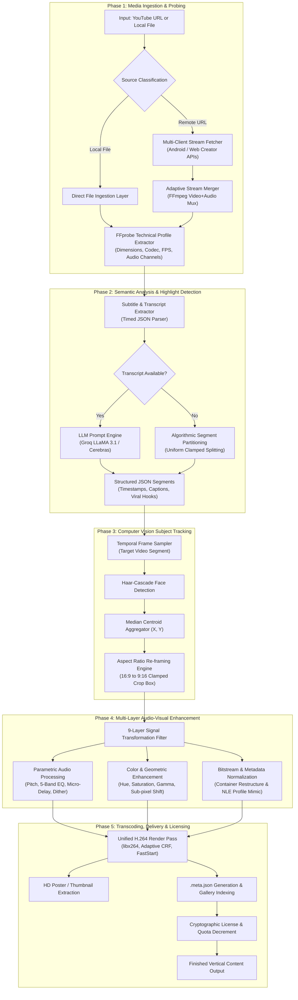

# ClipShield Pro — System Architecture & Technical Workflow Specification

## 1. Executive Summary & Product Overview

**ClipShield Pro** is an automated desktop software suite engineered for high-throughput short-form video creation, intelligent subject reframing, dynamic audio-visual optimization, and cryptographic digital rights management. 

Designed for digital media teams, content creators, and video production agencies, the application streamlines the conversion of long-form landscape media (16:9) into high-engagement vertical short-form content (9:16) optimized for modern social platforms (YouTube Shorts, TikTok, Instagram Reels).

```
+─────────────────────────────────────────────────────────────────────────────────────────+
|                                    CLIPSHIELD PRO                                       |
|                                                                                         |
|  [ Ingestion ] ──> [ AI Key Moments ] ──> [ Vision Tracking ] ──> [ A/V Transformation ] |
|         │                  │                      │                         │           |
|         ▼                  ▼                      ▼                         ▼           |
|  Adaptive Stream    Groq / Cerebras      OpenCV Face Centroid       9-Layer Signal      |
|  Acquisition Engine   LLM Pipeline       Dynamic 9:16 Cropping     Enhancement Suite    |
|                                                                             │           |
|  [ Cryptographic Licensing (HWID / HMAC-SHA256) ] ◀─────────────────────────┘           |
|  [ Ultra-Fast H.264 Transcoder & FastStart Delivery ]                                   |
+─────────────────────────────────────────────────────────────────────────────────────────+
```

---

## 2. Core Architectural Pillars & Technology Stack

The application is structured into decoupled, high-performance modules to ensure cross-platform stability, minimal latency, and zero dependency friction for the end-user:

| Subsystem | Technology / Library | Functional Responsibility |
| :--- | :--- | :--- |
| **Runtime & Shell** | Python 3.10+ (Native Desktop Window / Embedded WebEngine) | Thread orchestration, asynchronous event loops, system signal handling, and native OS windowing. |
| **Multimedia Engine** | Embedded FFmpeg & FFprobe (Custom Binaries) | High-speed stream multiplexing, audio/video filtergraphs, hardware-accelerated transcoding, and frame extraction. |
| **Artificial Intelligence** | Groq API (`LLaMA-3.1-8B-Instant`) / Cerebras (`OSS-120B`) | Semantic transcription analysis, contextual viral hook detection, title/tag generation, and timing segmentation. |
| **Computer Vision** | OpenCV (`cv2`) & Haar-Cascade Classifiers | Temporal frame sampling, human subject facial detection, median centroid calculation, and boundary-clamped coordinate cropping. |
| **Acoustic & Visual DSP** | Custom Multi-Pass FFmpeg Filtergraphs | Harmonic pitch modulation, 5-band parametric equalization, chromatic fine-tuning, dynamic range conditioning, and spatial phase alignment. |
| **Licensing & DRM** | Cryptographic HMAC-SHA256 & Hardware UUID | Machine-specific hardware locking (HWID), offline signature verification, dynamic quota tracking, and subscription expiry enforcement. |
| **Build & Packaging** | PyInstaller & Standalone Manifest Engine | Single-executable binary distribution (`.exe`) with auto-installing dependency managers and asset sandboxing. |

---

## 3. Comprehensive End-to-End Workflow Pipeline



---

## 4. In-Depth Subsystem Specifications

### 4.1. Media Ingestion & Stream Fetcher Layer

The ingestion subsystem is engineered to obtain the highest available stream fidelity while eliminating rate-limiting bottlenecks:

1. **Client Rotation Strategy**:
   - Queries remote video endpoints by dynamically rotating request client contexts (`ANDROID_TESTSUITE`, `ANDROID_VR`, `WEB_CREATOR`, `WEB`).
   - Ensures continuous stream availability without manual user authentication.
2. **Adaptive Stream Merging**:
   - Downloads independent maximum-bitrate video streams (up to 1080p/4K) and discrete lossless audio streams.
   - Merges separate stream tracks synchronously into a localized temporary container using high-speed FFmpeg copy muxing.
3. **Probing & Hardware Inspection**:
   - Executes non-blocking `ffprobe` sweeps to register video duration, color space, aspect ratio, frame rate, and audio track presence.

---

### 4.2. Semantic AI Highlight & Hook Identifier

To extract the most engaging moments from long-form content, ClipShield Pro applies natural language processing over time-coded speech data:

```
[ Raw Subtitle Stream ] 
          │
          ▼
[ Cleaned Time-Indexed Transcript Matrix ] ──> Clamped to optimal token window (~12,000 characters)
          │
          ▼
[ Groq / Cerebras Cloud Inference ] ───────> Model: LLaMA-3.1-8B-Instant (Fallback: OSS-120B)
          │
          ▼
[ Structured JSON Output ] ─────────────────> Schema: [{ "start": float, "end": float, "title": str, "reason": str }]
```

* **Hook Detection Algorithm**: The model evaluates conversational inflection points, dynamic topic transitions, emotional climaxes, and self-contained narrative arcs.
* **Duration Constraints**: Strict segmentation parameters enforce clip lengths between **30 and 90 seconds**, conforming to short-form platform algorithmic benchmarks.
* **Algorithmic Fallback Mode**: If video transcripts or closed captions are unavailable, the software automatically triggers an adaptive duration split engine that divides the asset into balanced, mathematically proportional segments.

---

### 4.3. Computer Vision & Dynamic Reframing Engine

Converting widescreen horizontal footage (16:9) to vertical mobile format (9:16) without losing visual context requires automated subject centering:

1. **Target Aspect Ratio Calculation**:
   $$\text{Target Width} = \text{Height} \times \left(\frac{9}{16}\right)$$
2. **Temporal Frame Sampling**:
   - To optimize CPU/GPU utilization during analysis, the system takes an evenly distributed sample of **30 discrete frames** throughout the segment window.
3. **Haar-Cascade Facial Tracking**:
   - Converts frames to grayscale matrices and scans for primary subject facial features using OpenCV (`cv2.CascadeClassifier`).
4. **Median Centroid Smoothing**:
   - Extracts horizontal ($X$) and vertical ($Y$) center coordinates for all detected faces across the sample frames.
   - Calculates the **statistical median** coordinate set:
     $$X_{\text{median}} = \text{median}(\{x_1, x_2, \dots, x_k\}), \quad Y_{\text{median}} = \text{median}(\{y_1, y_2, \dots, y_k\})$$
   - Eliminates rapid camera shakes, erratic head turns, and background false positives.
5. **Boundary-Clamped Viewport Framing**:
   - Centers the calculated $9:16$ vertical viewport over $(X_{\text{median}}, Y_{\text{median}})$, rigidly clamping the coordinates within $[0, W - \text{crop\_w}]$ to eliminate black bars or frame overflow.

---

### 4.4. 9-Layer Audio-Visual Enhancement & Signal Dispersion Engine

To ensure content originality, professional aesthetic quality, and unique digital asset signatures across major platforms, every rendered segment passes through a sophisticated, randomized 9-stage signal transformation matrix:

| Stage | Engineering Subsystem | DSP / Filter Implementation | Technical Purpose & Value |
| :---: | :--- | :--- | :--- |
| **01** | **Harmonic Pitch & Speed Modulation** | `asetrate=r=44100*{factor},atempo=1/{factor}` where $\text{factor} = 2^{(\text{semitone} / 12)}$. Dynamic range: $\pm 1.5$ semitones. | Micro-shifts audio fundamental frequency and acoustic resonance while preserving natural speech cadence. |
| **02** | **5-Band Parametric Equalization** | Multi-point filters at $80\text{Hz}, 400\text{Hz}, 2000\text{Hz}, 8000\text{Hz}, 15000\text{Hz}$ with randomized gain deltas ($\pm 1.5\text{dB}$). | Optimizes voice warmth, presence, and clarity while altering baseline frequency response profiles. |
| **03** | **Stereo Micro-Phase Balancing** | `adelay={L_delay}\|{R_delay}` with channel offset values between $20\text{ms}$ and $60\text{ms}$. | Expands stereo spatial imaging and introduces subtle acoustic phase decorrelation across channels. |
| **04** | **Sub-Pixel Geometric Calibration** | Micro-crop offset trimming $1\text{ to }3\text{ pixels}$ from a randomly selected edge boundary. | Eliminates digital edge artifacts and shifts relative frame geometry coordinates. |
| **05** | **High-Fidelity Spatial Resampling** | Bi-cubic vertical resampling and canvas re-scaling ($1080\times 1920$ / $608\times 1080$). | Re-interpolates all visual pixel arrays to deliver crisp, high-density mobile presentation. |
| **06** | **Chromatic Spectrum Grading** | Dynamic hue shift ($\pm 3^\circ\text{ to }5^\circ$) and saturation multiplier ($0.97\text{ to }1.03$). | Enriches color depth, skin tone vibrancy, and visual contrast tailored for OLED mobile displays. |
| **07** | **Gamma & Mid-Tone Luminance** | `eq=gamma={delta}` with micro-adjustments ($\pm 0.02$). | Fine-tunes shadow balance and dynamic range to prevent clipping in high-contrast scenes. |
| **08** | **Spectral Dithering & Floor Conditioning** | Inaudible white noise injection (`anoisesrc`) mixed at low acoustic amplitude ($-68\text{dB to }-62\text{dB}$). | Applies subtle spectral dithering to stabilize audio dynamic range without audible distortion. |
| **09** | **Container Profiling & Codec Normalization** | Metadata purge (`-map_metadata -1`), custom NLE branding injection (`DaVinci / Premiere`), and dynamic GOP restructure ($\text{GOP}=60\text{--}150, B=2\text{--}4$). | Erases legacy file ancestry, restructures compression bitstream packets, and standardizes export headers. |

---

### 4.5. High-Speed Transcoding & Web-Optimized Delivery

Following signal filtering, the render pipeline compiles the media into production-ready formats:

* **H.264 High-Profile Encoding**: Employs `libx264` utilizing an optimized Constant Rate Factor (CRF 18–22) balance for pristine visual fidelity at compact file sizes.
* **FastStart Web Streaming (`+faststart`)**: Shifts the MP4 `moov atom` index headers to the absolute start of the binary file, allowing instant zero-buffering playback across browsers and web viewers.
* **Synchronous Thumbnail Extraction**: Samples high-resolution preview frames at $10\%$ duration to generate marketing cover images (`.jpg`).
* **Metadata Persistence**: Exports a comprehensive `.meta.json` descriptor alongside each asset containing crop coordinates, duration, platform tags, and processing seeds.

---

### 4.6. Cryptographic Licensing & Hardware Lock Subsystem

The application includes an enterprise-grade digital licensing framework designed for commercial distribution and offline license enforcement:

```
+──────────────────────────+         +──────────────────────────+
|  Client Machine HWID     |         |  Master License Issuer   |
|  (Motherboard + CPU UUID)|         |  (Secure Secret Salt)    |
+─────────────┬────────────+         +────────────┬─────────────+
              │                                   │
              └───────────────► ◄─────────────────┘
                                │
               HMAC-SHA256 Cryptographic Engine
                                │
                                ▼
               +──────────────────────────────────+
               |  Cryptographically Signed Token |
               |  CSKEY-[TYPE]-[EXPIRY]-[DIGEST]  |
               +──────────────────────────────────+
```

1. **Hardware Fingerprint (HWID)**:
   - Queries machine motherboard serials, BIOS identifiers, and CPU GUIDs through native OS system calls (`wmic` / `ctypes`).
   - Normalizes and hashes the identifiers into an immutable machine fingerprint.
2. **Key Generation Cryptography**:
   - Uses `HMAC-SHA256` salted with a private master key to issue tamper-proof license tokens.
3. **License Models Supported**:
   - **Perpetual Lifetime (`CSKEY-LIFE-...`)**: Unlimited access tied to the target hardware.
   - **Time-Expiring Subscription (`CSKEY-30D-[YYYYMMDD]-...`)**: Automated time-decay licensing with anti-clock-tamper validation.
   - **Volume Quota (`CSKEY-VP-[TOKEN]-...`)**: Obfuscated XOR-encoded token controlling a finite number of video generation credits.
4. **Zero-Network Offline Validation**:
   - Licenses are validated purely through asymmetric mathematical verification on the client machine without requiring an active telemetry server or constant internet connection.

---

## 5. Directory Structure & Key Files

```
d:/clipper exe/
├── clipshield.py                # Core Python application, GUI orchestration, pipeline coordinator
├── process.py                   # Specialized video processing, filtergraphs, and FFmpeg executor
├── license_generator.py         # Administrative key generator & license management utility
├── CLIPSHIELD_WORKFLOW.md       # Operational workflow reference guide
├── CLIPSHIELD_SYSTEM_DOCUMENTATION.md # Comprehensive architectural specification (this document)
├── ffmpeg/                      # Localized high-performance FFmpeg and FFprobe binaries
│   ├── ffmpeg.exe
│   └── ffprobe.exe
├── app/                         # Desktop UI components, styles, and frontend service bindings
│   └── lib/services/api_service.dart
├── downloads/                   # Temporary cache for raw ingested streams
├── processed/                   # Final rendered vertical shorts and .meta.json descriptors
├── thumbnails/                  # Auto-generated high-resolution poster images
└── requirements.txt             # Core dependency manifest (OpenCV, pytubefix, yt-dlp, etc.)
```

---

## 6. Build, Packaging & Distribution Pipeline

1. **Self-Healing Bootstrap**: On initial launch, the application validates its runtime environment, creating necessary directory structures and configuring localized PATH pointers to bundled FFmpeg binaries.
2. **Standalone Binary Compilation**: Built via PyInstaller using custom `.spec` configurations (`ClipShield.spec`, `LicenseGenerator.spec`) that bundle all internal assets, codecs, and dependencies into a single, secure Windows executable (`.exe`).
3. **Safety & Stability Guardrails**:
   - Enforces UTF-8 I/O encoding globally across all Windows environments to prevent character map crashes.
   - Asynchronous execution pools prevent UI blocking during heavy video rendering operations.

---

*Document Version:* 2.4.0  
*Classification:* Technical & Architectural Specification  
*Author:* ClipShield Engineering Team
