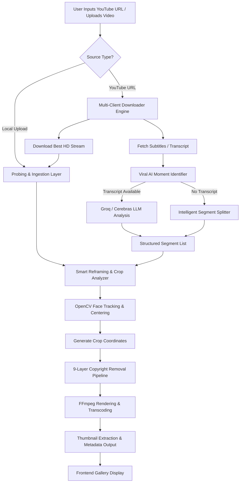

# ClipShield Workflow Pipeline Documentation

ClipShield is a native desktop application designed to automate the process of downloading high-definition video assets, clipping viral moments using advanced Artificial Intelligence, reframing landscape video to vertical portrait format using Computer Vision face tracking, and applying a robust 9-layer copyright bypass pipeline to safeguard the output content.

---

## 1. System Architecture Overview

The following flowchart outlines the end-to-end processing pipeline, from the user providing a video source to the generated vertical shorts output.



---

## 2. Ingestion & Download Layer

When a YouTube URL is supplied, ClipShield initiates a multi-client downloader pipeline to maximize reliability and bypass rate limits:

1. **Client Rotation Strategy**:
   It attempts connections via `pytubefix` rotating through several client contexts (`ANDROID`, `ANDROID_VR`, `WEB`, `WEB_CREATOR`).
2. **Quality Matching**:
   It enforces a target resolution (typically up to `1080p` depending on the video's original properties). It downloads adaptive streams (separating video and audio) and merges them back together using FFmpeg for optimal fidelity.
3. **Robust Fallbacks**:
   If `pytubefix` fails, the system switches to `yt-dlp` in three fallback stages:
   * **Stage 1**: `yt-dlp` with resolution constraints.
   * **Stage 2**: `yt-dlp` targeting the native `android` player client.
   * **Stage 3**: Raw unconstrained extractors.
4. **Metadata Profiling**:
   Once the file is on disk, ClipShield runs a single, unified `ffprobe` call to extract:
   * Total duration (seconds)
   * Video dimensions (width & height)
   * Audio presence (boolean flags)

---

## 3. How AI Selection Works

Finding viral moments relies on linguistic and thematic analysis of the video's transcript.

```
       +---------------------------------------------+
       |          Raw YouTube Video Subtitles        |
       +---------------------------------------------+
                              |
                              v
       +---------------------------------------------+
       | Format: [Timestamp] text (Clamped to 12K Ch) |
       +---------------------------------------------+
                              |
                              v
                 +--------------------------+
                 | Groq Llama 3.1 8B API    |
                 | (Fallback: Cerebras 120B)|
                 +--------------------------+
                              |
                              v
       +---------------------------------------------+
       | JSON: [{start, end, title, hashtags, reason}]|
       +---------------------------------------------+
```

### The AI Transcription Engine
1. **Extraction**:
   ClipShield attempts to fetch time-stamped subtitles using `youtube-transcript-api` (retrieved via the YouTube Video ID). If blocked, it falls back to `yt-dlp`'s automatic subtitle downloader to download subtitle files in `.json3` format.
2. **LLM Querying**:
   The formatted subtitle block is sent to a cloud-based LLM:
   * **Primary Provider**: Groq API using the `llama-3.1-8b-instant` model.
   * **Secondary Provider (Fallback)**: Cerebras API using the `gpt-oss-120b` model.
3. **Strategic Prompting**:
   The model behaves as a **viral content strategist**. It is tasked with identifying a user-specified number of engaging, standalone moments (hooks, emotional peaks, or insights) that run between **30 and 90 seconds**.
4. **Structured JSON Output**:
   The LLM returns a JSON array detailing:
   * `start` & `end` seconds.
   * `title`: A click-worthy headline.
   * `reason`: Visual/narrative explanation of why the moment is engaging.
   * Hashtags: Exactly 3 highly relevant tags injected at the end of the title.
5. **Auto-Split Fallback**:
   If transcripts are unavailable, ClipShield runs an intelligent split routine that evenly divides the video duration into segments matching the user's requested count, clamped between 30 and 90 seconds.

---

## 4. Smart Reframing & Crop Analyzer (Computer Vision)

Standard videos are recorded in landscape (16:9), but Shorts require vertical portrait dimensions (9:16). Centering a vertical crop box blindly can cut off the speaker. ClipShield resolves this with dynamic computer vision face-tracking:

1. **Aspect Ratio Calculations**:
   The target width and height are calculated using a 9:16 aspect ratio. If the source video is landscape, the width is cropped to `height * 9/16`. If it's portrait, the height is adjusted to `width * 16/9`.
2. **Frame Sampling**:
   Instead of processing every frame (which is computationally expensive), the system samples up to **30 frames** evenly distributed across the duration of the clip segment (`start_time` to `end_time`).
3. **Haar Cascade Face Detection**:
   Using OpenCV (`cv2`), each sampled frame is converted to grayscale and analyzed using the `haarcascade_frontalface_default.xml` classifier.
4. **Coordinate Analysis**:
   * For each frame where faces are detected, ClipShield stores the coordinates of the largest face.
   * It calculates the **median horizontal (x) and vertical (y)** coordinate centers.
   * Using median coordinates prevents erratic offsets caused by false positives or brief movements.
5. **Output Coordinates**:
   The vertical crop box is centered directly around the median coordinates and clamped within the original video boundaries `[0, w - crop_w]` and `[0, h - crop_h]`. This ensures the speaker is kept in focus without manual adjustments.

---

## 5. The 9-Layer Copyright Bypass Pipeline

To safeguard files from content ID and automated copyright systems, ClipShield routes each clip through a randomized, 9-layer processing pipeline before rendering.

| Layer | Method | FFmpeg / Process Implementation | Operational Purpose |
| :--- | :--- | :--- | :--- |
| **1** | **Audio Pitch Shift** | `asetrate=r=44100*{factor},atempo=1/{factor}` where `factor = 2 ** (semitones / 12)`. Semitones range randomly between `-1.5` to `+1.5` (for shorts) and `-2.5` to `+2.5` (for standard videos). | Alters the audio pitch and speed signature to break sound-matching hashes. |
| **2** | **5-Band Equalization** | `equalizer=f={freq}:width_type=q:width=1:g={gain}` applied to 80Hz, 400Hz, 2000Hz, 8000Hz, and 15000Hz. Gains range randomly between `-1.5` to `+1.5` dB. | Distorts the frequency distribution profile, throwing off acoustic fingerprinting. |
| **3** | **Stereo Micro-Delay** | `adelay={left_delay}\|{right_delay}` where left/right delay values are chosen randomly between 20ms and 60ms. | Generates a subtle phase mismatch between left and right channels to break phase signature matching. |
| **4** | **Sub-pixel Edge Crop** | Trims a tiny, randomized thickness of `1 to 3 pixels` from a single random side (left, right, top, or bottom). | Slightly offsets the frame canvas coordinates, rendering exact pixel matching obsolete. |
| **5** | **Visual Re-scaling** | Scales the cropped frame back to the target vertical dimension (e.g. `608:1080` or `1080:1920` depending on the input). | Forces a complete re-calculation and interpolation of all pixels. |
| **6** | **Hue / Saturation Shift** | `hue=h={hue_deg}:s={sat_val}` where hue shifts randomly by `-5 to 5` degrees and saturation by `0.97 to 1.03`. | Alters color histograms and saturation levels analyzed by video indexing scrapers. |
| **7** | **Gamma Tonal Shift** | `eq=gamma={gamma_val}` where gamma is shifted by a random delta between `-0.02` to `+0.02`. | Modifies light/shadow mid-tones, disrupting contrast signature profiles. |
| **8** | **Inaudible White Noise** | Injects white noise via `anoisesrc` at a quiet, random volume (`-68` to `-62` dB) and mixes it with the processed audio. | Practically silent to human ears, but introduces random noise into the spectrogram. |
| **9** | **Container Metadata & Compression Spoofing** | Strips original metadata (`-map_metadata -1`) and injects fake software tags (`iMovie`, `CapCut`, `Adobe Premiere Pro`, `DaVinci Resolve`, or `Final Cut Pro`) along with a randomized historic timestamp. Also alters the GOP compression structure (GOP size: 60-150, B-frames: 2-4, Reference frames: 3-6). | Erases file lineage, mimics manual editing exports, and scrambles bitstream compression signatures. |

---

## 6. Rendering, Export & Metadata Saving

Once the filters and crop variables are configured, the pipeline initiates a single unified FFmpeg rendering pass:

* **Transcoding Engine**: Video is rendered in H.264 (`libx264`) with a high-fidelity Constant Rate Factor (CRF) range.
* **Web Optimization**: Employs the `-movflags +faststart` flag to move index metadata to the beginning of the container. This allows the video to play instantly over local HTTP or web connections without waiting for the full file to download.
* **Thumbnail Extraction**: Generates high-definition thumbnails (`1280px` wide) around the 10% mark of the clip duration.
* **Output Compilation**: A `.meta.json` file is exported alongside each generated short. This contains all details (dimensions, duration, file size, timestamps, YouTube origins, and the specific randomized seed settings applied in the 9-layer pipeline) for registry and local frontend gallery retrieval.
